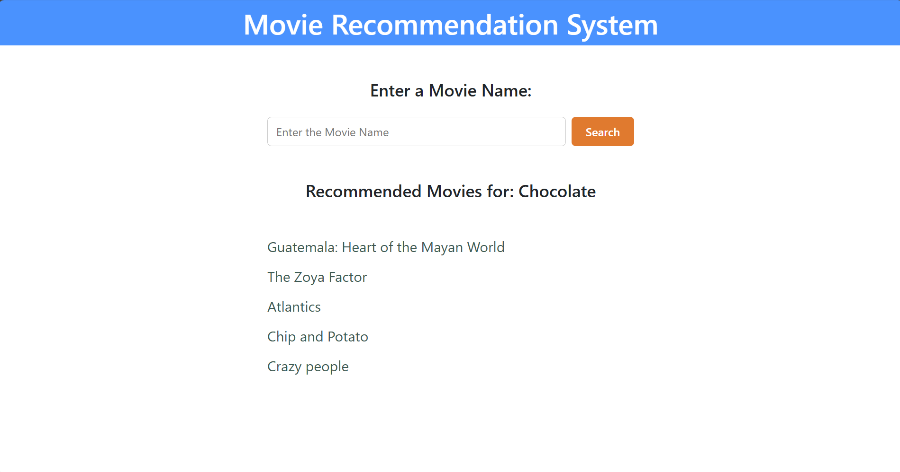

## 🎬 Movie Recommendation System (ML + Flask)

A full-stack Movie Recommendation Web Application built using Python, Machine Learning, and Flask.
The system suggests the Top 5 movies similar to a user-selected movie using TF-IDF vectorization and Cosine Similarity.

---

## 🚀 Features

1. Search for a movie by name
2. Get Top 5 similar movie recommendations
3. Uses TF-IDF Vectorization for text processing
4. Uses Cosine Similarity to compute similarity scores
5. Handles invalid movie names gracefully
6. Clean and simple user interface
7. Modular structure (ML logic separated from Flask app)

---

## 🧠 How It Works

1. Movie dataset is loaded using Pandas
2. Text features (overview/genres) are combined
3. Text is converted into numerical vectors using TF-IDF
4. Cosine similarity is calculated between movies
5. When a user enters a movie name:
    - The system finds the movie
    - Computes similarity scores   
    - Returns the Top 5 most similar movies

---

## 🛠️ Tech Stack

- Python
- Flask
- Pandas
- NumPy
- Scikit-learn
- HTML + CSS + Bootstrap

---

## 📂 Project Structure

movie-recommender-flask/
│
├── app.py
├── recommender.py
├── requirements.txt
├── README.md
├── img1.png
│
├── data/
│   └── movies.csv
│
├── templates/
│   ├── index.html
│
├── static/
│   └── style.css

---

## 📸 Project Preview

<p align="center">
  
</p>

---

## ▶️ How to Run the Project

1. Clone the repository:
    ```bash
    git clone https://github.com/Vidushi-coder/movie-recommender-flask.git
    ```
2. Navigate into the project folder:
    ```bash
    cd movie-recommender-flask
    ```
3. Install dependencies:
    ```bash
    pip install -r requirements.txt
    ```
4. Run the application:
    ```bash
    python app.py
    ```
5. Open your browser and visit:
    http://127.0.0.1:5000/